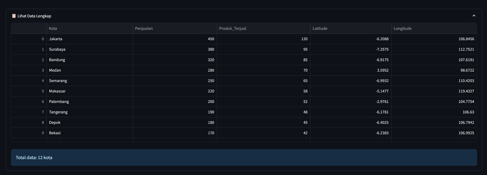
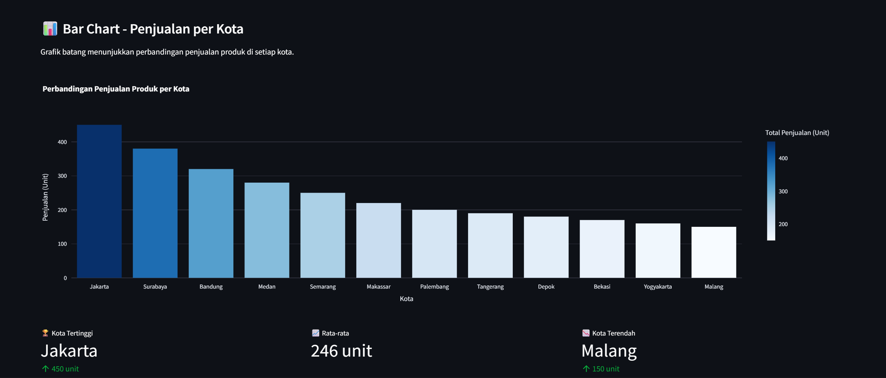
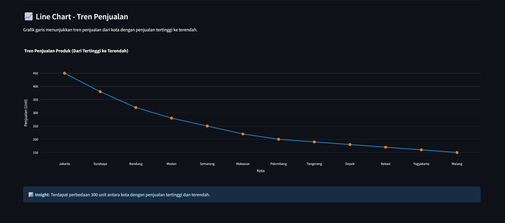
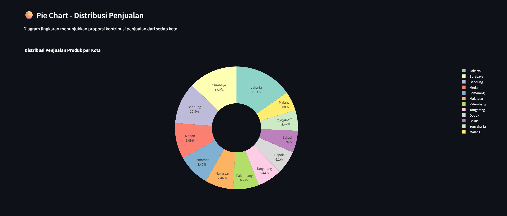
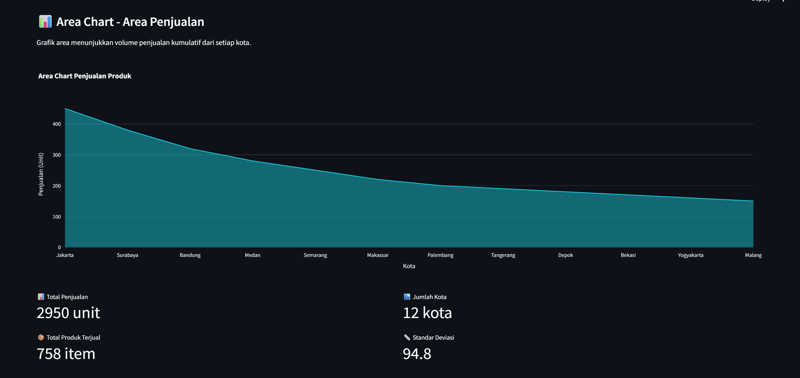
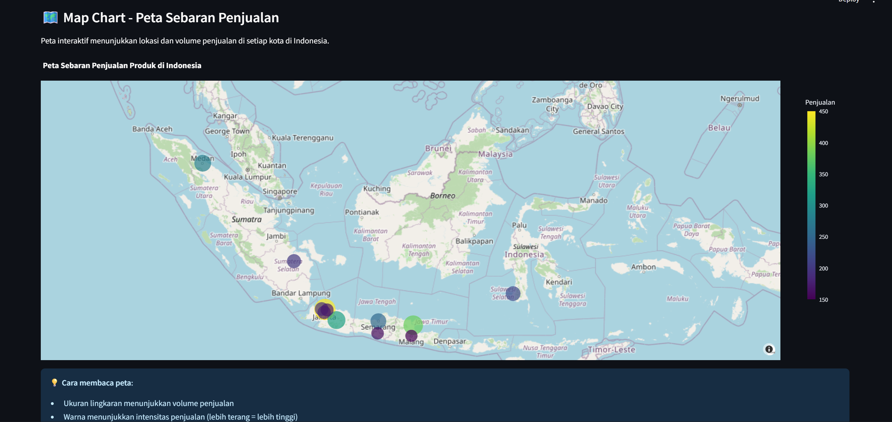

# LAPORAN PRAKTIKUM
# VISUALISASI DATA INTERAKTIF MENGGUNAKAN STREAMLIT

**Nama:** Pangeran Borneo Silaen  
**NIM:** 10231073  
**Mata Kuliah:** Administrasi Basis Data  

---

## 1. PENDAHULUAN

### 1.1 Latar Belakang
Visualisasi data merupakan salah satu aspek penting dalam administrasi dan analisis basis data. Dengan visualisasi yang tepat, informasi kompleks dari database dapat disajikan dalam bentuk yang lebih mudah dipahami. Praktikum ini bertujuan untuk mengimplementasikan dashboard interaktif menggunakan Streamlit yang mampu menampilkan berbagai jenis visualisasi data berdasarkan pilihan pengguna.

### 1.2 Tujuan
Tujuan dari praktikum ini adalah:
1. Memahami cara membuat aplikasi web interaktif menggunakan Streamlit
2. Mengimplementasikan berbagai jenis visualisasi data (Bar Chart, Line Chart, Pie Chart, Area Chart, dan Map Chart)
3. Menerapkan konsep data manipulation menggunakan Pandas
4. Membuat dashboard yang responsif dengan komponen interaktif

### 1.3 Tools dan Library yang Digunakan
- **Streamlit**: Framework untuk membuat aplikasi web data science
- **Pandas**: Library untuk manipulasi dan analisis data
- **Plotly**: Library untuk membuat visualisasi interaktif
- **Python**: Bahasa pemrograman utama

---

## 2. DASAR TEORI

### 2.1 Streamlit
Streamlit adalah framework open-source yang memungkinkan data scientist dan developer untuk membuat aplikasi web interaktif dengan cepat menggunakan Python. Framework ini dirancang khusus untuk visualisasi data dan machine learning, dengan fokus pada kesederhanaan dan kecepatan development.

### 2.2 Pandas DataFrame
Pandas merupakan library Python yang digunakan untuk manipulasi dan analisis data. DataFrame adalah struktur data dua dimensi yang mirip dengan tabel database atau spreadsheet, yang memudahkan proses pengolahan data.

### 2.3 Plotly
Plotly adalah library visualisasi interaktif yang mendukung berbagai jenis grafik. Keunggulan Plotly adalah kemampuannya menghasilkan grafik yang interaktif dengan fitur zoom, pan, dan hover information.

---

## 3. IMPLEMENTASI

### 3.1 Struktur Aplikasi

Aplikasi ini terdiri dari beberapa komponen utama:
1. Konfigurasi halaman
2. Dataset penjualan produk
3. Komponen dropdown untuk pemilihan visualisasi
4. Implementasi lima jenis visualisasi
5. Statistik dan metrics pendukung

### 3.2 Konfigurasi Awal

```python
import streamlit as st
import pandas as pd
import plotly.express as px
import plotly.graph_objects as go

st.set_page_config(
    page_title="Dashboard Penjualan Produk",
    page_icon="📊",
    layout="wide"
)
```

Pada bagian ini, dilakukan import library yang diperlukan dan konfigurasi halaman menggunakan `st.set_page_config()`. Parameter `layout="wide"` digunakan untuk membuat tampilan dashboard menggunakan lebar penuh layar, sehingga visualisasi dapat ditampilkan dengan lebih optimal.

### 3.3 Dataset

Dataset yang digunakan berisi informasi penjualan produk elektronik dari 12 kota di Indonesia:

```python
data = {
    'Kota': ['Jakarta', 'Surabaya', 'Bandung', 'Medan', 'Semarang', 
             'Makassar', 'Palembang', 'Tangerang', 'Depok', 'Bekasi',
             'Yogyakarta', 'Malang'],
    'Penjualan': [450, 380, 320, 280, 250, 220, 200, 190, 180, 170, 160, 150],
    'Produk_Terjual': [120, 95, 85, 70, 65, 58, 52, 48, 45, 42, 40, 38],
    'Latitude': [-6.2088, -7.2575, -6.9175, 3.5952, -6.9932,
                 -5.1477, -2.9761, -6.1781, -6.4025, -6.2383, -7.7956, -7.9666],
    'Longitude': [106.8456, 112.7521, 107.6191, 98.6722, 110.4203,
                  119.4327, 104.7754, 106.6300, 106.7942, 106.9925, 110.3695, 112.6326]
}

df = pd.DataFrame(data)
```

Dataset disusun dalam bentuk dictionary Python, kemudian dikonversi menjadi Pandas DataFrame. Dataset mencakup kolom nama kota, jumlah penjualan, jumlah produk terjual, serta koordinat geografis (latitude dan longitude) yang akan digunakan untuk visualisasi peta.



Tampilan data dalam bentuk tabel interaktif memudahkan untuk melihat detail setiap record. Tabel ini menampilkan 12 kota dengan informasi lengkap meliputi jumlah penjualan, produk terjual, dan koordinat geografis. Streamlit menyediakan komponen `st.dataframe()` yang menghasilkan tabel interaktif dengan fitur sorting dan scrolling.

### 3.4 Komponen Interaktif

```python
jenis_chart = st.selectbox(
    "Pilih visualisasi yang ingin ditampilkan:",
    ["Bar Chart", "Line Chart", "Pie Chart", "Area Chart", "Map Chart"],
    index=0
)
```

Fungsi `st.selectbox()` digunakan untuk membuat dropdown menu yang memungkinkan pengguna memilih jenis visualisasi. Parameter `index=0` menentukan pilihan default adalah Bar Chart. Setiap kali pengguna mengubah pilihan, aplikasi akan secara otomatis me-render ulang halaman dengan visualisasi yang dipilih.

---

## 4. JENIS-JENIS VISUALISASI

### 4.1 Bar Chart (Grafik Batang)



Bar Chart digunakan untuk membandingkan nilai antar kategori. Dalam implementasi ini, grafik batang menampilkan perbandingan penjualan produk di setiap kota.

```python
fig = px.bar(
    df, 
    x='Kota', 
    y='Penjualan',
    color='Penjualan',
    color_continuous_scale='Blues',
    labels={'Penjualan': 'Total Penjualan (Unit)'},
    title='Perbandingan Penjualan Produk per Kota'
)
```

**Penjelasan Teknis:**
- `px.bar()` adalah fungsi dari Plotly Express untuk membuat bar chart
- Parameter `x` dan `y` menentukan data untuk sumbu horizontal dan vertikal
- Parameter `color='Penjualan'` membuat gradasi warna berdasarkan nilai penjualan
- `color_continuous_scale='Blues'` menentukan skema warna biru dengan gradasi
- `labels` digunakan untuk mengubah label sumbu yang ditampilkan
- Fungsi `update_layout()` digunakan untuk menyesuaikan tinggi grafik dan label sumbu

Bar Chart cocok digunakan ketika ingin membandingkan nilai absolut antar kategori yang berbeda. Dalam kasus ini, terlihat jelas bahwa Jakarta memiliki penjualan tertinggi, diikuti oleh Surabaya dan Bandung.

### 4.2 Line Chart (Grafik Garis)



Line Chart digunakan untuk menampilkan tren atau perubahan data secara berurutan. Dalam implementasi ini, data diurutkan dari penjualan tertinggi ke terendah untuk menunjukkan tren penurunan.

```python
df_sorted = df.sort_values('Penjualan', ascending=False).reset_index(drop=True)

fig = px.line(
    df_sorted, 
    x='Kota', 
    y='Penjualan',
    markers=True,
    title='Tren Penjualan Produk (Dari Tertinggi ke Terendah)'
)
fig.update_traces(
    line=dict(color='#1f77b4', width=3),
    marker=dict(size=10, color='#ff7f0e')
)
```

**Penjelasan Teknis:**
- Data diurutkan terlebih dahulu menggunakan `sort_values()` dengan parameter `ascending=False` untuk urutan menurun
- `reset_index(drop=True)` digunakan untuk mengatur ulang index setelah sorting
- Parameter `markers=True` menambahkan titik penanda pada setiap data point
- `update_traces()` digunakan untuk kustomisasi tampilan garis dan marker
- `line=dict(color='#1f77b4', width=3)` mengatur warna dan ketebalan garis
- `marker=dict(size=10, color='#ff7f0e')` mengatur ukuran dan warna marker

Line Chart efektif untuk menunjukkan tren dan pola dalam data. Visualisasi ini memudahkan untuk melihat gap atau selisih penjualan antar kota secara berurutan.

### 4.3 Pie Chart (Diagram Lingkaran)



Pie Chart digunakan untuk menampilkan proporsi atau persentase dari keseluruhan data. Implementasi ini menggunakan donut chart variant untuk tampilan yang lebih modern.

```python
fig = px.pie(
    df, 
    values='Penjualan', 
    names='Kota',
    title='Distribusi Penjualan Produk per Kota',
    hole=0.4,
    color_discrete_sequence=px.colors.qualitative.Set3
)
fig.update_traces(textposition='inside', textinfo='percent+label')
```

**Penjelasan Teknis:**
- `px.pie()` adalah fungsi untuk membuat pie chart
- Parameter `values` menentukan nilai numerik yang akan direpresentasikan
- Parameter `names` menentukan label untuk setiap slice
- Parameter `hole=0.4` membuat donut chart dengan lubang di tengah sebesar 40% dari radius
- `color_discrete_sequence` menggunakan palet warna Set3 dari Plotly
- `textposition='inside'` menempatkan label di dalam slice
- `textinfo='percent+label'` menampilkan persentase dan nama label

Pie Chart sangat berguna untuk memvisualisasikan komposisi atau kontribusi relatif dari setiap kategori terhadap total. Dari visualisasi ini, terlihat bahwa Jakarta berkontribusi paling besar terhadap total penjualan.

### 4.4 Area Chart (Grafik Area)



Area Chart mirip dengan line chart, namun area di bawah garis diisi dengan warna. Visualisasi ini efektif untuk menunjukkan volume atau magnitude data.

```python
df_sorted = df.sort_values('Penjualan', ascending=False).reset_index(drop=True)

fig = px.area(
    df_sorted, 
    x='Kota', 
    y='Penjualan',
    title='Area Chart Penjualan Produk',
    color_discrete_sequence=['#17becf']
)
fig.update_layout(
    xaxis_title="Kota",
    yaxis_title="Penjualan (Unit)",
    height=500,
    hovermode='x unified'
)
```

**Penjelasan Teknis:**
- Data diurutkan terlebih dahulu seperti pada line chart
- `px.area()` membuat area chart dengan area terisi di bawah garis
- `color_discrete_sequence=['#17becf']` menentukan warna area menggunakan kode hex
- Parameter `hovermode='x unified'` membuat hover tooltip muncul untuk seluruh sumbu x secara bersamaan
- Area chart memberikan emphasis visual yang lebih kuat pada volume data dibanding line chart

Area Chart cocok digunakan untuk menampilkan data kumulatif atau volume. Visualisasi ini memberikan kesan yang lebih "solid" dibandingkan line chart, sehingga cocok untuk menunjukkan besaran atau magnitude data.

### 4.5 Map Chart (Peta Geografis)



Map Chart menampilkan data dalam bentuk peta geografis, sangat berguna untuk visualisasi data berbasis lokasi.

```python
fig = px.scatter_mapbox(
    df,
    lat='Latitude',
    lon='Longitude',
    size='Penjualan',
    color='Penjualan',
    hover_name='Kota',
    hover_data={
        'Penjualan': ':,',
        'Produk_Terjual': ':,',
        'Latitude': False,
        'Longitude': False
    },
    color_continuous_scale='Viridis',
    size_max=30,
    zoom=4,
    title='Peta Sebaran Penjualan Produk di Indonesia'
)

fig.update_layout(
    mapbox_style="open-street-map",
    height=600,
    margin={"r":0,"t":50,"l":0,"b":0}
)
```

**Penjelasan Teknis:**
- `px.scatter_mapbox()` membuat scatter plot di atas peta interaktif
- Parameter `lat` dan `lon` menentukan koordinat geografis setiap titik
- Parameter `size='Penjualan'` membuat ukuran marker proporsional dengan nilai penjualan
- Parameter `color='Penjualan'` memberikan gradasi warna berdasarkan nilai
- `hover_name` menentukan judul tooltip saat hover
- `hover_data` mengkonfigurasi data yang ditampilkan dalam tooltip
- Format `:,` menambahkan separator ribuan pada angka
- `Latitude: False` dan `Longitude: False` menyembunyikan koordinat dari tooltip
- `color_continuous_scale='Viridis'` menggunakan skema warna Viridis yang colorblind-friendly
- `size_max=30` membatasi ukuran maksimum marker
- `zoom=4` mengatur level zoom awal peta
- `mapbox_style="open-street-map"` menggunakan base map dari OpenStreetMap

Map Chart sangat efektif untuk visualisasi data geografis, memungkinkan analisis spatial pattern dan distribusi data berdasarkan lokasi. Interaktivitas peta (zoom, pan) memudahkan eksplorasi detail di setiap region.

---

## 5. FITUR TAMBAHAN

### 5.1 Komponen Expander untuk Data Table

```python
with st.expander("📋 Lihat Data Lengkap"):
    st.dataframe(df, use_container_width=True)
    st.info(f"Total data: {len(df)} kota")
```

Komponen expander membuat data table dapat dibuka-tutup sesuai kebutuhan pengguna. Parameter `use_container_width=True` membuat tabel menggunakan lebar penuh container.

### 5.2 Metrics dan Statistik

```python
col1, col2, col3 = st.columns(3)
with col1:
    st.metric("🏆 Kota Tertinggi", df.loc[df['Penjualan'].idxmax(), 'Kota'], 
             f"{df['Penjualan'].max()} unit")
with col2:
    st.metric("📈 Rata-rata", f"{df['Penjualan'].mean():.0f} unit")
with col3:
    st.metric("📉 Kota Terendah", df.loc[df['Penjualan'].idxmin(), 'Kota'], 
             f"{df['Penjualan'].min()} unit")
```

Fungsi `st.columns()` membuat layout kolom untuk menampilkan beberapa metrics secara berdampingan. Fungsi `st.metric()` menampilkan nilai dalam format kartu yang informatif. Penggunaan `idxmax()` dan `idxmin()` untuk menemukan index dari nilai maksimum dan minimum, kemudian `loc[]` untuk mengambil nama kota yang sesuai.

---

## 6. CARA MENJALANKAN APLIKASI

### 6.1 Instalasi Dependencies

Sebelum menjalankan aplikasi, pastikan semua library terinstall dengan menjalankan perintah:

```powershell
pip install -r requirements.txt
```

File requirements.txt berisi:
```
streamlit==1.29.0
pandas==2.1.4
plotly==5.18.0
```

### 6.2 Menjalankan Aplikasi

Untuk menjalankan aplikasi, gunakan perintah:

```powershell
streamlit run app.py
```

Aplikasi akan otomatis membuka browser pada alamat `http://localhost:8501`. Streamlit menyediakan fitur hot-reload, sehingga perubahan pada kode akan langsung terlihat setelah file disimpan.

---

## 7. ANALISIS DAN PEMBAHASAN

### 7.1 Perbandingan Jenis Visualisasi

Setiap jenis visualisasi memiliki kelebihan untuk kasus penggunaan tertentu:

**Bar Chart:**
- Kelebihan: Mudah dibaca untuk perbandingan nilai antar kategori
- Cocok untuk: Data kategorikal dengan jumlah kategori terbatas
- Kasus penggunaan: Membandingkan penjualan antar kota

**Line Chart:**
- Kelebihan: Menunjukkan tren dan perubahan dengan jelas
- Cocok untuk: Data sequential atau time-series
- Kasus penggunaan: Melihat pola penurunan atau kenaikan penjualan

**Pie Chart:**
- Kelebihan: Menampilkan proporsi relatif dengan visual yang menarik
- Cocok untuk: Menunjukkan komposisi dari keseluruhan
- Kasus penggunaan: Melihat kontribusi setiap kota terhadap total penjualan

**Area Chart:**
- Kelebihan: Memberikan emphasis pada volume atau magnitude
- Cocok untuk: Data kumulatif atau untuk menunjukkan besaran
- Kasus penggunaan: Menampilkan volume penjualan secara visual

**Map Chart:**
- Kelebihan: Menampilkan distribusi geografis data
- Cocok untuk: Data dengan komponen lokasi
- Kasus penggunaan: Analisis spatial pattern penjualan di berbagai region

### 7.2 Insight dari Data

Berdasarkan visualisasi yang dihasilkan, dapat diperoleh beberapa insight:

1. **Dominasi Jakarta**: Jakarta memiliki penjualan tertinggi dengan 450 unit, menunjukkan market yang paling besar di wilayah tersebut.

2. **Pola Geografis**: Kota-kota besar di Pulau Jawa (Jakarta, Surabaya, Bandung) mendominasi penjualan, terlihat jelas pada visualisasi peta.

3. **Gap Penjualan**: Terdapat perbedaan signifikan sebesar 300 unit antara kota dengan penjualan tertinggi (Jakarta) dan terendah (Malang).

4. **Konsentrasi Market**: Top 3 kota (Jakarta, Surabaya, Bandung) berkontribusi sekitar 45% dari total penjualan, menunjukkan konsentrasi market yang tinggi.

### 7.3 Keunggulan Implementasi

Implementasi dashboard ini memiliki beberapa keunggulan:

1. **Interaktivitas**: Pengguna dapat memilih jenis visualisasi sesuai kebutuhan analisis
2. **Responsive Design**: Layout wide memaksimalkan penggunaan ruang layar
3. **Visualisasi Interaktif**: Menggunakan Plotly yang mendukung zoom, pan, dan hover information
4. **Informasi Lengkap**: Setiap visualisasi dilengkapi dengan statistik dan metrics pendukung
5. **User-Friendly**: Interface yang bersih dan mudah digunakan

---

## 8. KESIMPULAN

Praktikum ini berhasil mengimplementasikan dashboard visualisasi data interaktif menggunakan Streamlit dengan lima jenis visualisasi berbeda. Setiap jenis visualisasi memiliki karakteristik dan kegunaan masing-masing dalam menganalisis data penjualan produk.

Penggunaan Streamlit terbukti efektif untuk membuat aplikasi data science dengan cepat tanpa perlu pengetahuan mendalam tentang web development. Kombinasi Streamlit, Pandas, dan Plotly menghasilkan dashboard yang powerful namun tetap sederhana dalam implementasi.

Dari sisi pembelajaran, praktikum ini memberikan pemahaman tentang:
- Penggunaan Streamlit untuk membuat aplikasi web interaktif
- Implementasi berbagai jenis visualisasi dengan Plotly
- Manipulasi data menggunakan Pandas
- Best practices dalam menyajikan data untuk analisis

Dashboard yang dihasilkan dapat dikembangkan lebih lanjut dengan menambahkan fitur filtering, data real-time dari database, atau integrasi dengan sumber data eksternal.

---

## 9. LAMPIRAN

### 9.1 Struktur File Project

```
praktikum_13/
├── app.py
├── requirements.txt
├── README.md
├── images/
│   ├── BarChart.png
│   ├── LineChart.png
│   ├── PieChart.png
│   ├── AreaChart.png
│   └── MapChart.png
└── PANGERAN BORNEO SILAEN_10231073_LAPORAN-PRAKTIKUM_.md
```

### 9.2 Referensi

1. Streamlit Documentation: https://docs.streamlit.io/
2. Plotly Python Documentation: https://plotly.com/python/
3. Pandas Documentation: https://pandas.pydata.org/docs/
4. Python Data Visualization Best Practices

---


